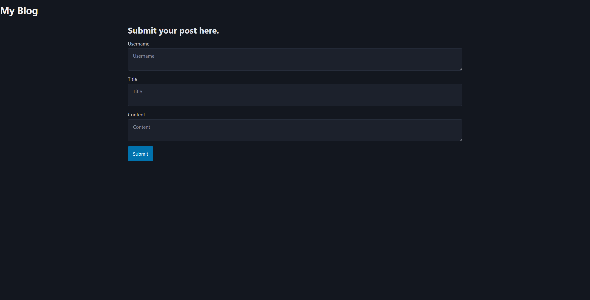
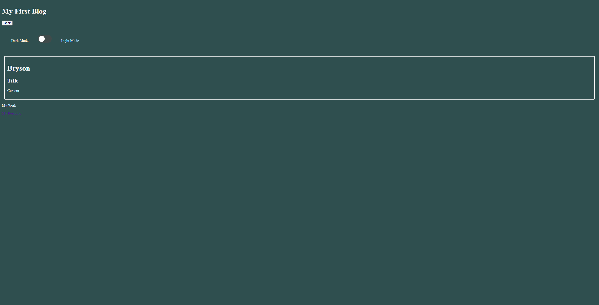

# My Blog Challange

## Description

Provide a short description explaining the what, why, and how of your project. Use the following questions as a guide:

- What was your motivation?
- Why did you build this project? (Note: the answer is not "Because it was a homework assignment.")
- What problem does it solve?
- What did you learn?

## Links
[Live Url](https://bryson987081.github.io/my-blog-challange/)

[GitHub Repo](https://github.com/Bryson987081/my-blog-challange)